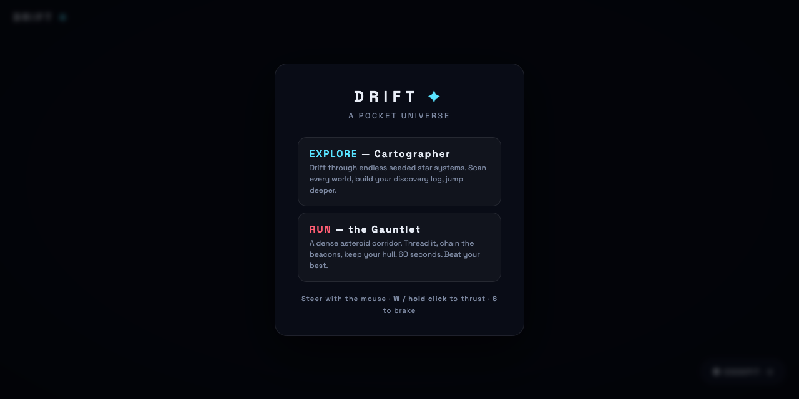

# DRIFT

A pocket universe in your browser. Fly a detailed ship through a bloom-lit Milky Way and enter every body you find: terrain worlds with habitats, star plasma interiors with a heat timer, gas-giant cloud oceans.

  

**Try it: https://suncal.github.io/drift/**

## What it does

- Two modes: **Explore** (endless seeded systems, discovery log) and **Run** (a dense asteroid gauntlet with a clock)
- Land on and survey every planet; fly *into* stars and gas giants with their own physics
- Cockpit flight-sim mode with procedural engine audio (Web Audio, no samples)
- ACES tonemapping, bloom, textured planets, one GLB ship model, no framework

## Run it

Open `index.html` through any static server (`python3 -m http.server`) and fly. Mouse steers, **W** / hold-click thrusts, **S** brakes.

---

**If this is useful to you, a ⭐ on the repo helps other people find it.** Issues and pull requests are welcome.

Built by [Priyankar "Sunny" Chakraborty](https://github.com/suncal) · [everbuiltstudio.com](https://everbuiltstudio.com)
